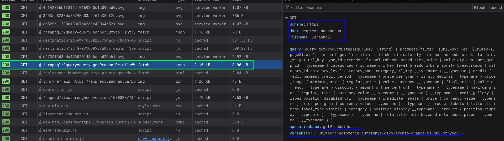

# AFEScraper

AFEScraper is a Go application that collects product prices from Auchan, Fozzy, and Epicentrk online stores and sends a daily summary to a Telegram chat.

## Features

- Scrapes prices from three major Ukrainian retailers
- Sends formatted price updates to Telegram using the Bot API
- Configurable via environment variables
- Scheduled daily notifications using cron

## Requirements

- Go 1.18+
- Telegram Bot Token and Chat ID
- URLs and/or URLKeys for Auchan, Fozzy, and Epicentrk products

## Setup

1. **Clone the repository:**

   ```sh
   git clone https://github.com/h1pp0crates/AFEScraper.git
   cd AFEScraper
   ```

2. **Copy and edit the configuration file:**

   See [`env.example`](./env.example) for required environment variables. Rename it to `.env` and fill in your credentials and product URLs.

3. **Install dependencies:**

   ```sh
   go mod tidy
   ```

4. **Run the application:**

   ```sh
   go run main.go
   ```

## How It Works

- On startup, AFEScraper loads configuration from `.env`.
- Every day at 11:00, it scrapes prices from Auchan, Fozzy, and Epicentrk.
- It sends a formatted message with the prices to your Telegram chat.

## Configuration

All settings are managed via environment variables in `.env`.
See [`env.example`](./env.example) for the required variables.

## Project Structure

- `main.go` — Entry point, scheduler, and configuration
- `internal/` — Shared types and utilities
- `sites/` — Scraper implementations for each retailer
- `telegram/` — Telegram message sender

## Finding the Auchan GraphQL Endpoint

This section explains how to locate and use the Auchan GraphQL API endpoint to fetch product details.

### 1. Open Developer Tools

- Press **F12** in your browser and switch to the **Network** tab.
- Reload any Auchan product page to capture network requests.

### 2. Identify the GraphQL Request

- Filter requests by the term `graphql` or `fetch`.
- Look for an entry with path `/graphql/?query=…` and **Initiator** set to `fetch`.
- In the **Headers** panel, verify:

  - **Host:** `express.auchan.ua`
  - **Path/URL:** `/graphql/`



### 3. Copy Request Components

- **Endpoint URL**:

  ```text
  https://express.auchan.ua/graphql/
  ```

- **Query Parameter**: the URL‑encoded GraphQL document specifying requested fields. (Note: I use a shortened version of this query, which you can find in [`auchan.go`](./sites/auchan.go).)
- **Operation Name**:

  ```text
  getProductDetail
  ```

  This tells the server which named query block to execute.

- **Variables Payload**:

  ```json
  { "urlKey": "<your-product-slug>" }
  ```

  Supplies the dynamic slug used by the query to filter results.

## Contributing

Pull requests and suggestions are welcome!
Feel free to open issues for bugs or feature requests.

## License

MIT License
